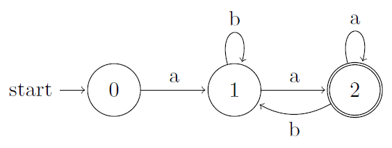
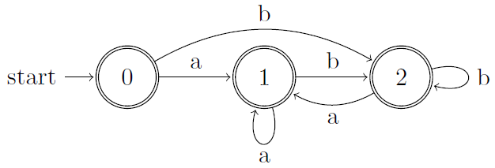
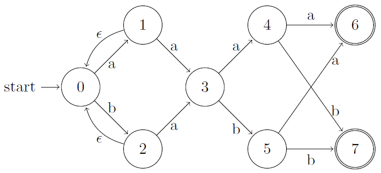
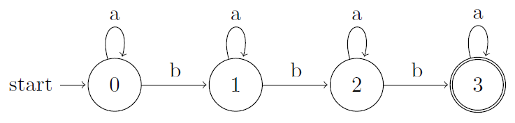
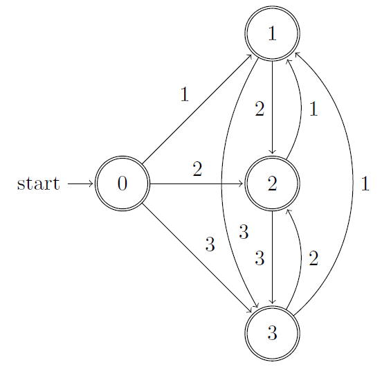
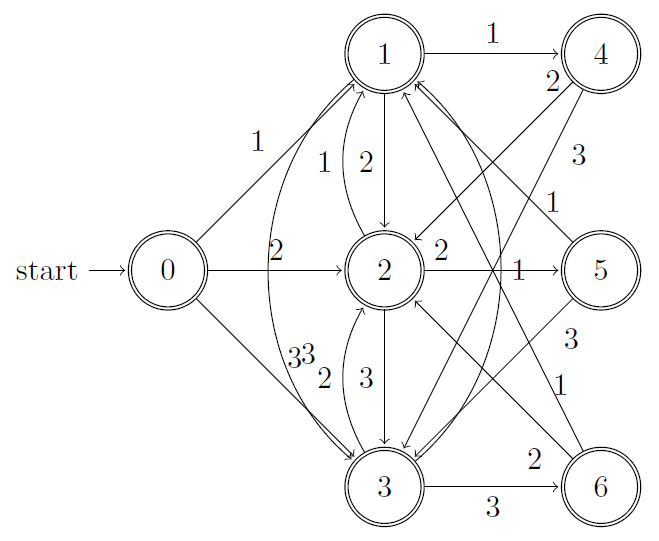

## 3.4 Recognition of Tokens

### 3.4.1

> Provide transition diagrams to recognize the same languages as each of the regular expressions in Exercise 3.3.2.
> 
> a\) $$\mathbf{a}(\mathbf{a}|\mathbf{b})^*\mathbf{a}$$.

> b\) $$((ϵ|\mathbf{a})\mathbf{b}^*)^*$$.

> c\) $$(\mathbf{a}|\mathbf{b})^*\mathbf{a}(\mathbf{a}|\mathbf{b})(\mathbf{a}|\mathbf{b})$$.

> d\) $$\mathbf{a}^*\mathbf{b}\mathbf{a}^*\mathbf{b}\mathbf{a}^*\mathbf{b}\mathbf{a}^*$$.

> e\) $$(\mathbf{a}\mathbf{a}|\mathbf{b}\mathbf{b})^*((\mathbf{a}\mathbf{b}|\mathbf{b}\mathbf{a})(\mathbf{a}\mathbf{a}|\mathbf{b}\mathbf{b})^*(\mathbf{a}\mathbf{b}|\mathbf{b}\mathbf{a})(\mathbf{a}\mathbf{a}|\mathbf{b}\mathbf{b})^*)^*$$

Nonsense.

### 3.4.2

> Provide transition diagrams to recognize the same languages as each of the regular expressions in Exercise 3.3.5.
> 
> d\) All strings of digits with no repeated digits.

> e\) All strings of digits with at most one repeated digit.

### 3.4.3

> Construct the failure function for the strings:
> 
> a\) abababaab.

001234512

> b\) aaaaaa.

012345

> c\) abbaabb.

0001123

### 3.4.4

See _32.4 The Knuth-Morris-Pratt algorithm_ in **CLRS**.

### 3.4.5

See 3.4.4.

### 3.4.6

> a\) abababaab.

12343456

> b\) abababbaa.

123434011

### 3.4.7

See 3.4.4.

### 3.4.8

See 3.4.4.

### 3.4.9

> The _Fibonacci strings_ are defined as follows:
> 
> 1. $$s_1 = \text{b}$$.
> 2. $$s_2 = \text{a}$$.
> 3. $$s_k = s_{k-1}s_{k-2}$$ for $$k > 2$$.
> 
> For example, $$s_3 = \text{ab}$$, $$s_4 = \text{aba}$$, and $$s_5 = abaab$$.
> 
> a\) What is the length of $$s_n$$?

See problem 4.4 in [CLRS](https://cyberzhg.gitbooks.io/clrs_solution/content/Chapter_04_Divide_and_Conquer/problems.html)

> b\) Construct the failure function for $$s_6$$.

$$s_6$$ = abaababa.

00112323

> c\) Construct the failure function for $$s_7$$.

$$s_7$$ = abaababaabaab.

0011232345645

### 3.4.10

See [cookie](https://github.com/CyberZHG/Cookie/blob/b258dc2280c1244049db16b86d21dc84f0234ec2/HDU/HDU2222%20Keywords%20Search.cpp).

### 3.4.11

> Construct the tries and compute the failure function for the following sets of keywords:
> 
> a\) aaa, abaaa, and ababaaa.
> 
> b\) all, fall, fatal, llama, and lame.
> 
> c\) pipe, pet, item, temper, and perpetual.

### 3.4.12

