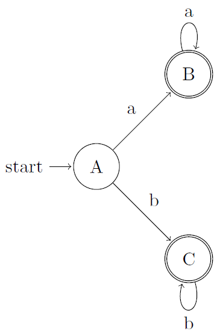
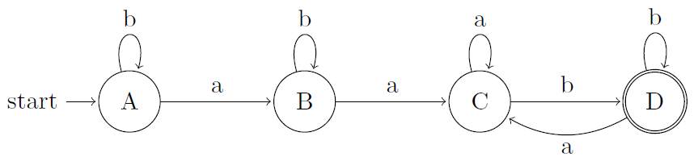
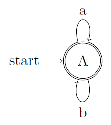
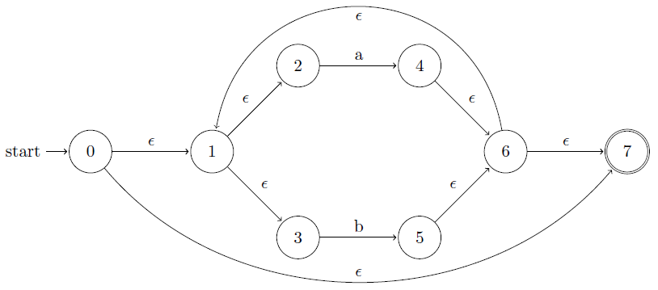
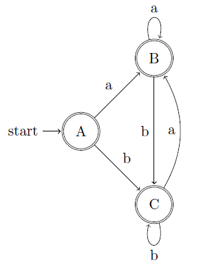
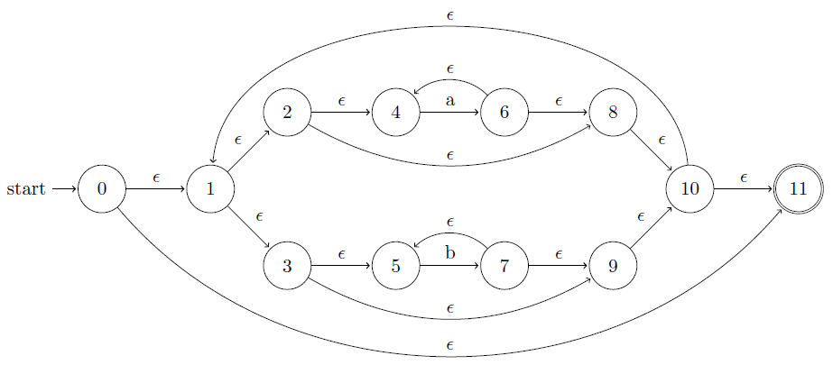
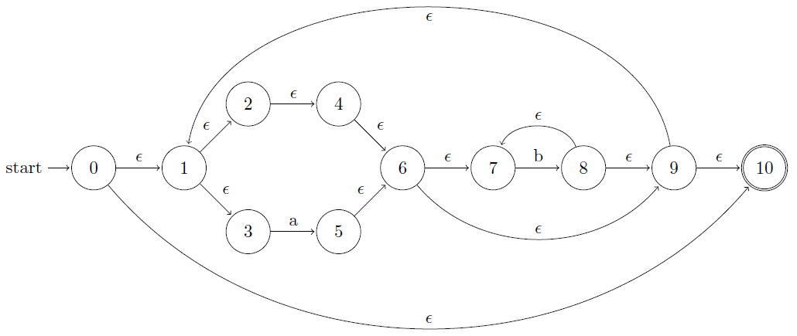
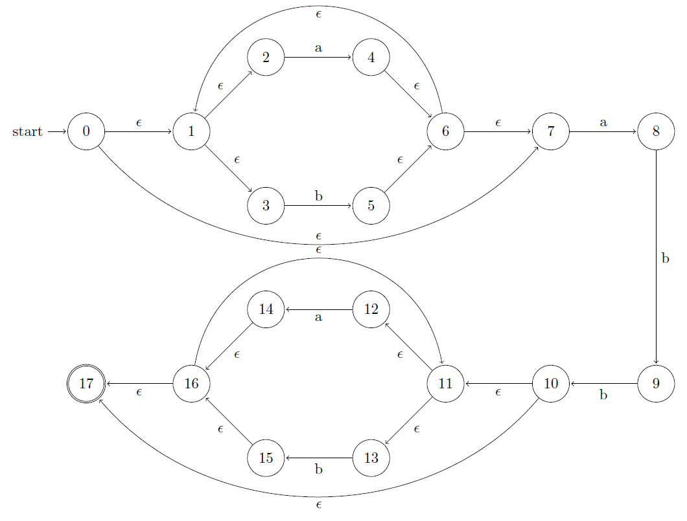
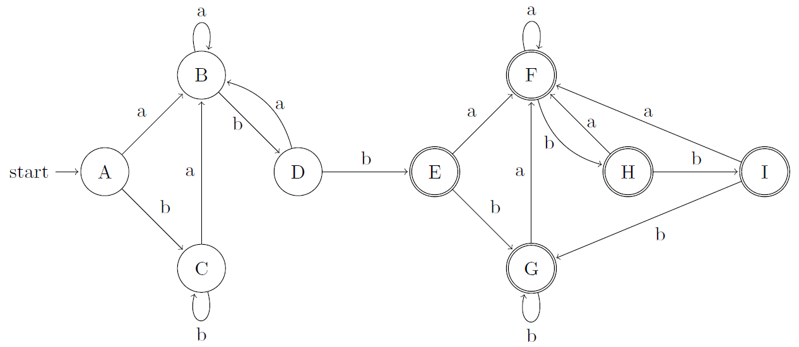

## 3.7 From Regular Expressions to Automata

### 3.7.1

> Convert to DFS's the NFA's of:

> a) Fig. 3.26.

| NFA STATE | DFA STATE | $$a$$ | $$b$$ |
|:---------:|:---------:|:-----:|:-----:|
|$$\{0,1,3\}$$|$$A$$|$$B$$|$$C$$|
|$$\{2\}$$|$$B$$|$$B$$|$$\emptyset$$|
|$$\{4\}$$|$$C$$|$$\emptyset$$|$$C$$|

> b) Fig. 3.29.

| NFA STATE | DFA STATE | $$a$$ | $$b$$ |
|:---------:|:---------:|:-----:|:-----:|
|$$\{0\}$$|$$A$$|$$B$$|$$A$$|
|$$\{0, 1\}$$|$$B$$|$$C$$|$$B$$|
|$$\{0, 1, 2\}$$|$$C$$|$$C$$|$$D$$|
|$$\{0, 1, 2, 3\}$$|$$D$$|$$C$$|$$D$$|

> c) Fig. 3.30.

| NFA STATE | DFA STATE | $$a$$ | $$b$$ |
|:---------:|:---------:|:-----:|:-----:|
|$$\{0, 1, 2, 3\}$$|$$A$$|$$A$$|$$A$$|

### 3.7.2

> use Algorithm 3.22 to simulate the NFA's:

> a) Fig. 3.29.

| String | State |
|:------:|:-----:|
| start | $$\{0\}$$ |
| a | $$\{0, 1\}$$ |
| a | $$\{0, 1, 2\}$$ |
| b | $$\{0, 1, 2, 3\}$$ |
| b | $$\{0, 1, 2, 3\}$$ |

> b) Fig. 3.30.

| String | State |
|:------:|:-----:|
| start | $$\{0, 1, 2, 3\}$$ |
| a | $$\{0, 1, 2, 3\}$$ |
| a | $$\{0, 1, 2, 3\}$$ |
| b | $$\{0, 1, 2, 3\}$$ |
| b | $$\{0, 1, 2, 3\}$$ |

### 3.7.3

> Convert the following regular expressions to deterministic finite automata, using algorithms 3.23 and 3.20:

> a) $$(a|b)*$$

[NFA](https://cyberzhg.github.io/toolbox/regex2nfa?regex=KGF8Yikq)
[DFA](https://cyberzhg.github.io/toolbox/nfa2dfa?regex=KGF8Yikq)

| NFA STATE | DFA STATE | $$a$$ | $$b$$ |
|:---------:|:---------:|:-----:|:-----:|
|$$\{0, 1, 2, 3, 7\}$$|$$A$$|$$B$$|$$C$$|
|$$\{1, 2, 3, 4, 6, 7\}$$|$$B$$|$$B$$|$$C$$|
|$$\{1, 2, 3, 5, 6, 7\}$$|$$C$$|$$B$$|$$C$$|

> b) $$(a*|b*)*$$

[NFA](https://cyberzhg.github.io/toolbox/regex2nfa?regex=KGEqfGIqKSo=)
[DFA](https://cyberzhg.github.io/toolbox/nfa2dfa?regex=KGEqfGIqKSo=)

| NFA STATE | DFA STATE | $$a$$ | $$b$$ |
|:---------:|:---------:|:-----:|:-----:|
|$$\{0,1,2,3,4,5,8,9,10,11\}$$|$$A$$|$$B$$|$$C$$|
|$$\{1,2,3,4,5,6,8,9,10,11\}$$|$$A$$|$$B$$|$$C$$|
|$$\{1,2,3,4,5,7,8,9,10,11\}$$|$$A$$|$$B$$|$$C$$|

> c) $$((\epsilon|a)b*)*$$

[NFA](https://cyberzhg.github.io/toolbox/regex2nfa?regex=KCjPtXxhKWIqKSo=)
[DFA](https://cyberzhg.github.io/toolbox/nfa2dfa?regex=KCjPtXxhKWIqKSo=)

| NFA STATE | DFA STATE | $$a$$ | $$b$$ |
|:---------:|:---------:|:-----:|:-----:|
|$$\{0,1,2,3,4,6,7,9,10,11\}$$|$$A$$|$$B$$|$$C$$|
|$$\{1,2,3,4,5,6,7,9,10,11\}$$|$$A$$|$$B$$|$$C$$|
|$$\{1,2,3,4,6,7,8,9,10,11\}$$|$$A$$|$$B$$|$$C$$|

> d) $$(a|b)*abb(a|b)*$$

[NFA](https://cyberzhg.github.io/toolbox/regex2nfa?regex=KGF8YikqYWJiKGF8Yikq)
[DFA](https://cyberzhg.github.io/toolbox/nfa2dfa?regex=KGF8YikqYWJiKGF8Yikq)

| NFA STATE | DFA STATE | $$a$$ | $$b$$ |
|:---------:|:---------:|:-----:|:-----:|
|$$\{0,1,2,3,7\}$$|$$A$$|$$B$$|$$C$$|
|$$\{1,2,3,4,6,7,8\}$$|$$B$$|$$B$$|$$D$$|
|$$\{1,2,3,5,6,7\}$$|$$C$$|$$B$$|$$C$$|
|$$\{1,2,3,4,6,7,9\}$$|$$D$$|$$B$$|$$E$$|
|$$\{1,2,3,5,6,7,10,11,12,13,17\}$$|$$E$$|$$F$$|$$G$$|
|$$\{1,2,3,4,6,7,8,11,12,13,14,16,17\}$$|$$F$$|$$F$$|$$H$$|
|$$\{1,2,3,5,6,7,11,12,13,15,16,17\}$$|$$G$$|$$F$$|$$G$$|
|$$\{1,2,3,5,6,7,9,11,12,13,15,16,17\}$$|$$H$$|$$F$$|$$I$$|
|$$\{1,2,3,5,6,7,10,11,12,13,15,16,17\}$$|$$I$$|$$F$$|$$G$$|

