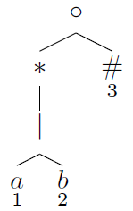
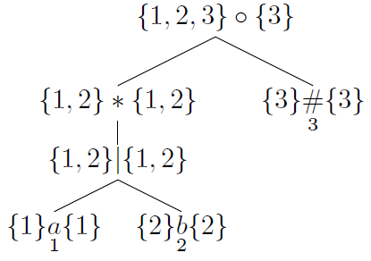
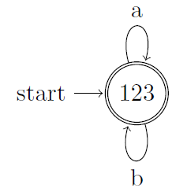

## 3.9 Optimization of DFA-Based Pattern Matches

### 3.9.1

> Extend the table of Fig. 3.58 to include the operators (a) `?` and (b) `+`.

| NODE $$n$$ | $$nullable(n)$$ | $$firstpos(n)$$ |
|:-:|:-:|:-:|
| $$n=c_1?$$ | __true__ | $$firstpos(c_1)$$ |
| $$n=c_1+$$ | __false__ | $$firstpos(c_1)$$ |

### 3.9.2

> Use Algorithm 3.36 to convert the regular expressions of Exercise 3.7.3 directly to deterministic finite automata.

> a) $$(a|b)*$$

| POSITION $$n$$ | $$followpos(n)$$ |
|:-:|:-:|
| 1 | $$\{1,2,3\}$$ |
| 2 | $$\{1,2,3\}$$ |
| 3 | $$\emptyset$$ |

### 3.9.3

### 3.9.4

### 3.9.5
