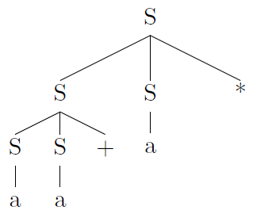
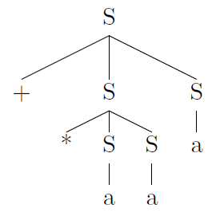
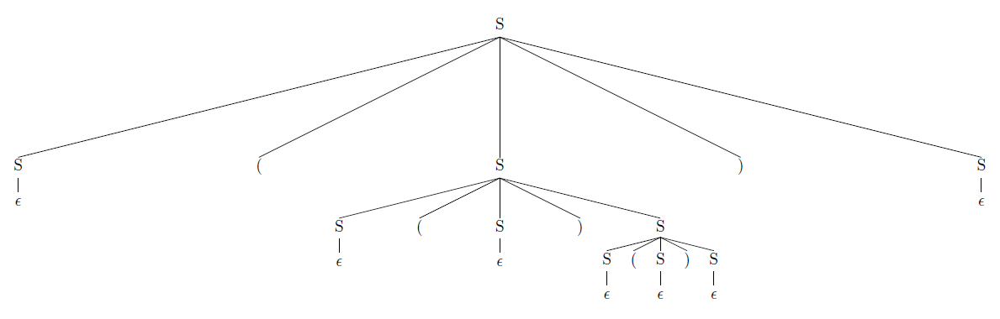
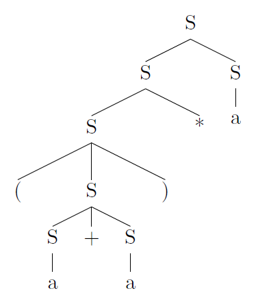

## 4.2 Context-Free Grammars

### 4.2.1

> Consider the context-free grammar:

> $$ S~\rightarrow~S~S~+~|~S~S~*~|~a$$

> and the string $$aa+a*$$.

> a) Give a leftmost derivation for the string.

$$
\begin{array}{rll}
S &\underset{lm}{\Rightarrow}& SS* \\
&\underset{lm}{\Rightarrow}& SS+S* \\
&\underset{lm}{\Rightarrow}& aS+S* \\
&\underset{lm}{\Rightarrow}& aa+S* \\
&\underset{lm}{\Rightarrow}& aa+a* \\
\end{array}
$$

> b) Give a rightmost derivation for the string.

$$
\begin{array}{rll}
S &\underset{rm}{\Rightarrow}& SS* \\
&\underset{rm}{\Rightarrow}& Sa* \\
&\underset{rm}{\Rightarrow}& SS+a* \\
&\underset{rm}{\Rightarrow}& Sa+a* \\
&\underset{rm}{\Rightarrow}& aa+a* \\
\end{array}
$$

> c) Give a parse tree for the string.

> d) Is the grammar ambiguous or unambiguous? Justify your answer.

Unambiguous.

> e) Describe the language generated by this grammar.

Suffix expressions.

### 4.2.2

> Repeat Exercise 4.2.1 for each of the following grammars and strings:

> a) $$S~\rightarrow~0~S~1~|~0~1$$ with string $$000111$$.

$$
\begin{array}{rll}
S &\underset{lm}{\Rightarrow}& 0S1 \\
&\underset{lm}{\Rightarrow}& 00S11 \\
&\underset{lm}{\Rightarrow}& 000111 \\
\end{array}
$$

$$
\begin{array}{rll}
S &\underset{rm}{\Rightarrow}& 0S1 \\
&\underset{rm}{\Rightarrow}& 00S11 \\
&\underset{rm}{\Rightarrow}& 000111 \\
\end{array}
$$

Unambiguous.

> b) $$S~\rightarrow~+~S~S~|~*~S~S~|~a$$ with string $$+*aaa$$.

$$
\begin{array}{rll}
S &\underset{lm}{\Rightarrow}& +SS \\
&\underset{lm}{\Rightarrow}& +*SSS \\
&\underset{lm}{\Rightarrow}& +*aSS \\
&\underset{lm}{\Rightarrow}& +*aaS \\
&\underset{lm}{\Rightarrow}& +*aaa \\
\end{array}
$$

$$
\begin{array}{rll}
S &\underset{rm}{\Rightarrow}& +SS \\
&\underset{rm}{\Rightarrow}& +Sa \\
&\underset{rm}{\Rightarrow}& +*SSa \\
&\underset{rm}{\Rightarrow}& +*Saa \\
&\underset{rm}{\Rightarrow}& +*aaa \\
\end{array}
$$

Unambiguous.

> c) $$S~\rightarrow~S~(~S~)~S~|~\epsilon$$ with string $$(()())$$.

$$
\begin{array}{rll}
S &\underset{lm}{\Rightarrow}& S(S)S \\
&\underset{lm}{\Rightarrow}& (S)S \\
&\underset{lm}{\Rightarrow}& (S(S)S)S \\
&\underset{lm}{\Rightarrow}& ((S)S)S \\
&\underset{lm}{\Rightarrow}& (()S)S \\
&\underset{lm}{\Rightarrow}& (()S(S)S)S \\
&\underset{lm}{\Rightarrow}& (()(S)S)S \\
&\underset{lm}{\Rightarrow}& (()()S)S \\
&\underset{lm}{\Rightarrow}& (()())S \\
&\underset{lm}{\Rightarrow}& (()()) \\
\end{array}
$$

$$
\begin{array}{rll}
S &\underset{rm}{\Rightarrow}& S(S)S \\
&\underset{rm}{\Rightarrow}& S(S) \\
&\underset{rm}{\Rightarrow}& S(S(S)S) \\
&\underset{rm}{\Rightarrow}& S(S(S)) \\
&\underset{rm}{\Rightarrow}& S(S()) \\
&\underset{rm}{\Rightarrow}& S(S(S)S()) \\
&\underset{rm}{\Rightarrow}& S(S(S)()) \\
&\underset{rm}{\Rightarrow}& S(S()()) \\
&\underset{rm}{\Rightarrow}& S(()()) \\
&\underset{rm}{\Rightarrow}& (()()) \\
\end{array}
$$

Ambiguous.

> d) $$S~\rightarrow~S~+~S~|~S~S~|~(~S~)|~S~*~|~a$$ with string $$(a+a)*a$$.

$$
\begin{array}{rll}
S &\underset{lm}{\Rightarrow}& SS \\
&\underset{lm}{\Rightarrow}& S*S \\
&\underset{lm}{\Rightarrow}& (S+S)*S \\
&\underset{lm}{\Rightarrow}& (a+S)*S \\
&\underset{lm}{\Rightarrow}& (a+a)*S \\
&\underset{lm}{\Rightarrow}& (a+a)*a \\
\end{array}
$$

$$
\begin{array}{rll}
S &\underset{rm}{\Rightarrow}& SS \\
&\underset{rm}{\Rightarrow}& Sa \\
&\underset{rm}{\Rightarrow}& S*a \\
&\underset{rm}{\Rightarrow}& (S+S)*a \\
&\underset{rm}{\Rightarrow}& (S+a)*a \\
&\underset{rm}{\Rightarrow}& (a+a)*a \\
\end{array}
$$

Ambiguous.

> e) $$S~\rightarrow~(~L~)~|~a$$ and $$L~\rightarrow~L~,~S~|~S~$$ with string $$((a,a),a,(a))$$.

$$
\begin{array}{rll}
S &\underset{lm}{\Rightarrow}& (L) \\
&\underset{lm}{\Rightarrow}& (L, S) \\
&\underset{lm}{\Rightarrow}& (L, S, S) \\
&\underset{lm}{\Rightarrow}& (S, S, S) \\
&\underset{lm}{\Rightarrow}& ((L), S, S) \\
&\underset{lm}{\Rightarrow}& ((L, S), S, S) \\
&\underset{lm}{\Rightarrow}& ((S, S), S, S) \\
&\underset{lm}{\Rightarrow}& ((a, S), S, S) \\
&\underset{lm}{\Rightarrow}& ((a, a), S, S) \\
&\underset{lm}{\Rightarrow}& ((a, a), a, S) \\
&\underset{lm}{\Rightarrow}& ((a, a), a, (L)) \\
&\underset{lm}{\Rightarrow}& ((a, a), a, (S)) \\
&\underset{lm}{\Rightarrow}& ((a, a), a, (a)) \\
\end{array}
$$

$$
\begin{array}{rll}
S &\underset{rm}{\Rightarrow}& (L) \\
&\underset{rm}{\Rightarrow}& (L, S) \\
&\underset{rm}{\Rightarrow}& (L, (L)) \\
&\underset{rm}{\Rightarrow}& (L, (S)) \\
&\underset{rm}{\Rightarrow}& (L, (a)) \\
&\underset{rm}{\Rightarrow}& (L, S, (a)) \\
&\underset{rm}{\Rightarrow}& (L, a, (a)) \\
&\underset{rm}{\Rightarrow}& (S, a, (a)) \\
&\underset{rm}{\Rightarrow}& ((L), a, (a)) \\
&\underset{rm}{\Rightarrow}& ((L, S), a, (a)) \\
&\underset{rm}{\Rightarrow}& ((L, a), a, (a)) \\
&\underset{rm}{\Rightarrow}& ((S, a), a, (a)) \\
&\underset{rm}{\Rightarrow}& ((a, a), a, (a)) \\
\end{array}
$$

Unambiguous.

> f) $$S~\rightarrow~a~S~b~S~|~b~S~a~S~|~\epsilon$$ with string $$aabbab$$.

$$
\begin{array}{rll}
S &\underset{lm}{\Rightarrow}& aSbS \\
&\underset{lm}{\Rightarrow}& aaSbSbS \\
&\underset{lm}{\Rightarrow}& aabSbS \\
&\underset{lm}{\Rightarrow}& aabbS \\
&\underset{lm}{\Rightarrow}& aabbaSbS \\
&\underset{lm}{\Rightarrow}& aabbabS \\
&\underset{lm}{\Rightarrow}& aabbab \\
\end{array}
$$

$$
\begin{array}{rll}
S &\underset{rm}{\Rightarrow}& aSbS \\
&\underset{rm}{\Rightarrow}& aSbaSbS \\
&\underset{rm}{\Rightarrow}& aSbaSb \\
&\underset{rm}{\Rightarrow}& aSbab \\
&\underset{rm}{\Rightarrow}& aaSbSbab \\
&\underset{rm}{\Rightarrow}& aaSbbab \\
&\underset{rm}{\Rightarrow}& aabbab \\
\end{array}
$$

Ambiguous.

> g) The following grammar for boolean expressions:

> $$
\begin{array}{rll}
bexpr &\rightarrow& bexpr~\mathbf{or}~bterm~|~bterm \\
bterm &\rightarrow& bterm~\mathbf{and}~bfactor~|~bfactor \\
bfactor &\rightarrow& \mathbf{not}~bfactor~|~(~bexpr~)~|~\mathbf{true}~|~\mathbf{false} \\
\end{array}
$$

Unambiguous.

### 4.2.3

> Design grammars for the following languages:

> a) The set of all strings of 0s and 1s such that every 0 is immediately followed by at least one 1.

$$S~\rightarrow~0~1~S~|~1~S~|~\epsilon$$

> b) The set of all strings of 0s and 1s that are palindromes.

$$S~\rightarrow~0~S~1~|~1~S~0~|~0~|~1~|~\epsilon$$

> c) The set of all strings of 0s and 1s with an equal number of 0s and 1s.

$$S~\rightarrow~0~S~1~S~|~1~S~0~S~|~\epsilon$$

> d) The set of all strings of 0s and 1s with an unequal number of 0s and 1s.

$$\begin{array}{lll}
S &\rightarrow& S_0~|~S_1 \\
S_0 &\rightarrow& T~0~S_0~|~T~0~T\\
S_1 &\rightarrow& T~0~S_1~|~T~0~T\\
T &\rightarrow& 0~T~1~T~|~1~T~0~T~|~\epsilon \\
\end{array}$$

> e) The set of all strings of 0s and 1s in which 011 does not appear as a substring.

$$\begin{array}{lll}
S &\rightarrow& 0~T~S~|~1~S~|~0~|~\epsilon \\
T &\rightarrow& 1~0~S~|~0~T~|~1 \\
\end{array}$$

> f) The set of all strings of 0s and 1s of the form $$xy$$, where $$x \ne y$$ and $$x$$ and $$y$$ are of the same length.

$$\begin{array}{lll}
S &\rightarrow& XY~|~YX \\
X &\rightarrow& TXT~|~0 \\
Y &\rightarrow& TYT~|~1 \\
T &\rightarrow& 0~|~1 \\
\end{array}$$

### 4.2.4

> There is an extended grammar notation in common use. Show that these two extensions do not add power to grammars; that is, any language that can be generated by a grammar with these extensions can be generated by a grammar without the extensions.

* i)

$$A~\rightarrow~X~[~Y~]~Z$$

equals

$$A~\rightarrow~X~Z~|~X~Y~Z$$

* ii)

$$A~\rightarrow~X~\{~Y~\}~Z$$

equals

$$\begin{array}{lll}
A &\rightarrow& X~B~Z \\
B &\rightarrow& Y~B~|~\epsilon \\
\end{array}$$

### 4.2.5

> Use the braces described in Exercise 4.2.4 to simplify the following grammar for statement blocks and conditional statements:

> $$\begin{array}{lcl}
stmt &\rightarrow& \mathbf{if}~expr~\mathbf{then}~stmt~\mathbf{else}~stmt \\
&|& \mathbf{if}~expr~\mathbf{then}~stmt \\
&|& \mathbf{begin}~stmtList~\mathbf{end} \\
stmtList &\rightarrow& stmt;~stmtList~|~stmt \\
\end{array}$$

$$\begin{array}{lcl}
stmt &\rightarrow& \mathbf{if}~expr~\mathbf{then}~stmt~[~\mathbf{else}~stmt~] \\
&|& \mathbf{begin}~stmtList~\mathbf{end} \\
stmtList &\rightarrow& stmt~\{~;~stmt~\} \\
\end{array}$$

### 4.2.6

> Extend the idea of Exercise 4.2.4 to allow any regular expression of grammar symbols in the body of a production. Show that this extension does not allow grammars to define any new languages.

Every regular expressions has the corresponding grammar.

### 4.2.7

> A grammar symbol $$X$$ is _useless_ if there is no derivation of the form $$S \overset{*}{\Rightarrow} wXy \overset{*}{\Rightarrow} wxy$$. That is, $$X$$ can never appear in the derivation of any sentense.

> a) Give an algorithm to eliminate from a grammar all productions containing useless symbols.

* Find all symbols that could not terminate:

Bottom-up: if a symbol generates a string that contains only terminals or symbols that could terminate, then this symbol could terminate.

All symbols that could not terminate are useless.

* Find all symbols that are not reachable:

After removing the symbols that could not terminate, start from the start symbol, if a symbol appears in the string generated by a symbol that is reachable, then this symbol is reachable.

All symbols that are not reachable are useless.

> b) Apply your algorithm to the grammar:

> $$
\begin{array}{lll}
S &\rightarrow& 0~|~A \\
A &\rightarrow& AB \\
B &\rightarrow& 1 \\
\end{array}
$$

First step:

$$
\begin{array}{lll}
S &\rightarrow& 0 \\
B &\rightarrow& 1 \\
\end{array}
$$

Second step:

$$
\begin{array}{lll}
S &\rightarrow& 0 \\
\end{array}
$$

### 4.2.8

> The grammar in Fig. 4.7 generates declarations for a single numerical identifier; these declarations involve four different, independent properties of numbers.

> $$
\begin{array}{lll}
stmt &\rightarrow& \mathbf{declare}~\mathbf{id}~optionList \\
optionList &\rightarrow& optionList~option~|~\epsilon \\
option &\rightarrow& mode~|~scale~|~precision~|~base \\
mode &\rightarrow& \mathbf{real}~|~\mathbf{complex} \\
scale &\rightarrow& \mathbf{fixed}~|~\mathbf{floating} \\
precision &\rightarrow& \mathbf{single}~|~\mathbf{double} \\
base &\rightarrow& \mathbf{binary}~|~\mathbf{decimal} \\
\end{array}
$$

> a) Generalize the grammar by allowing $$n$$ options $$A_i$$.

$$optionList~\rightarrow~A_1~|~A_2~|\dots|~A_n$$

> b) You must do better: a total production length that is $$O(n2^n)$$.

Force the ordering.

> c) Show that any grammar for part (b) must have a total production length of at least $$2^n$$.

> d) What does part (c) say about the feasibility of enforcing nonredundancy and noncontradiction among options in declarations via the syntax of the programming language.

The enforcing should not based on the syntax analysis with CFG.
