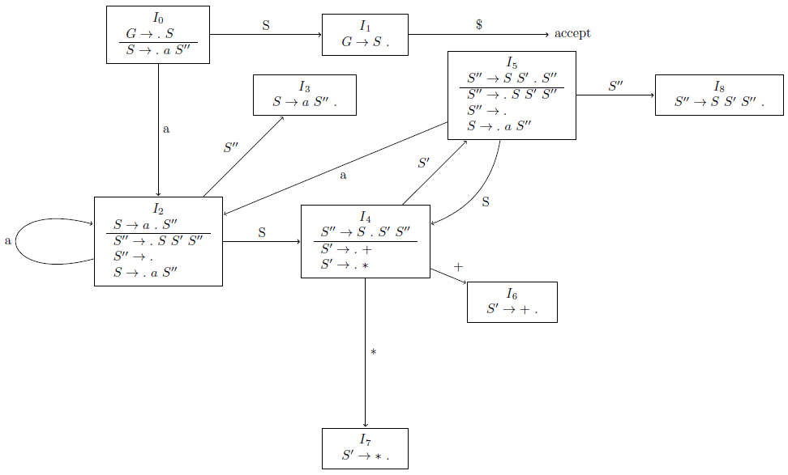
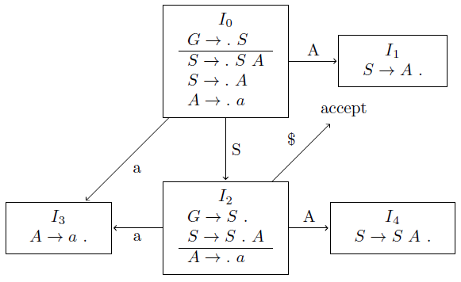

## 4.6 Introduction to LR Parsing: Simple LR

### 4.6.1

> Describe all the viable prefixes for the following grammars:

> a) The grammar $$S~\rightarrow~0~S~1~|~0~1$$ of Exercise 4.2.2(a).

$$\begin{array}{lcl}
S &\rightarrow& 0~S' \\
S' &\rightarrow& S~1~|~1 \\
\end{array}$$

Viable prefixes: $$0+$$

> b) The grammar $$S~\rightarrow~S~S~+~|~S~S~*~|~a$$ of Exercise 4.2.1.

$$\begin{array}{lcl}
S &\rightarrow& a~S^{\prime\prime} \\
S^{\prime\prime} &\rightarrow& S~S^\prime~S^{\prime\prime}~|~\epsilon \\
S^\prime &\rightarrow& +~|~* \\
\end{array}$$

Viable prefixes: $$S*$$

> c) The grammar $$S~\rightarrow~S~(~S~)~|~\epsilon$$ of Exercise 4.2.2(c).

$$\begin{array}{lcl}
S &\rightarrow& (~S~)~S~S~|~\epsilon \\
\end{array}$$

Viable prefixes: $$(*$$

### 4.6.2

> Construct the SLR sets of items for the (augmented) grammar of Exercise 4.2.1. Compute the GOTO function for these sets of items. Show the parsing table for this grammar. Is the grammar SLR?

$$\begin{array}{lcl}
G &\rightarrow& S \\
S &\rightarrow& a~S^{\prime\prime} \\
S^{\prime\prime} &\rightarrow& S~S^\prime~S^{\prime\prime}~|~\epsilon \\
S^\prime &\rightarrow& +~|~* \\
\end{array}$$

| STATE | $$a$$ | $$+$$ | $$*$$ | $$\$$$ | $$S$$ | $$S'$$ | $$S^{\prime\prime}$$ |
|:-----:|:-----:|:-----:|:-----:|:------:|:------:|:------:|:------:|
| 0 | s2 |  |  |  | 1 |  |  |
| 1 |  |  |  | acc |  |  |  |
| 2 | s2 | r($$S^{\prime\prime} \rightarrow \epsilon$$) | r($$S^{\prime\prime} \rightarrow \epsilon$$) | r($$S^{\prime\prime} \rightarrow \epsilon$$) | 4 |  | 3 |
| 3 | s2 | r($$S \rightarrow aS^{\prime\prime}$$) | r($$S \rightarrow aS^{\prime\prime}$$) | r($$S \rightarrow aS^{\prime\prime}$$) |  |  |  |
| 4 |  | s6 | s7 |  |  | 5 |  |
| 5 | s2 | r($$S^{\prime\prime} \rightarrow \epsilon$$) | r($$S^{\prime\prime} \rightarrow \epsilon$$) | r($$S^{\prime\prime} \rightarrow \epsilon$$) | 4 |  | 8 |
| 6 | r($$S' \rightarrow +$$) | r($$S' \rightarrow +$$) | r($$S' \rightarrow +$$) | r($$S' \rightarrow +$$) |  |  |  |
| 7 | r($$S' \rightarrow *$$) | r($$S' \rightarrow *$$) | r($$S' \rightarrow *$$) | r($$S' \rightarrow *$$) |  |  |  |
| 8 |  | r($$S^{\prime\prime} \rightarrow SS^\prime S^{\prime\prime}$$) | r($$S^{\prime\prime} \rightarrow SS^\prime S^{\prime\prime}$$) | r($$S^{\prime\prime} \rightarrow SS^\prime S^{\prime\prime}$$) |  |  |  |

It is SLR.

[LR(0)/SLR(1)](https://cyberzhg.github.io/toolbox/lr0?grammar=UyAtPiBTIFMgKyB8IFMgUyAqIHwgYQ==)

[LR(0)/SLR(1)](https://cyberzhg.github.io/toolbox/lr0?grammar=UyAtPiBhIFMnJwpTJycgLT4gUyBTJyBTJycgfCDPtQpTJyAtPiArIHwgKg==)

### 4.6.3

> Show the actions of your parsing table from Exercise 4.6.2 on the input $$aa*a+$$.

| STACK | SYMBOLS | INPUT | ACTION |
|:------|:--------|------:|:-------|
| 0 |  | $$aa*a+\$$$ | shift |
| 0 2 | $$a$$ | $$a*a+\$$$ | shift |
| 0 2 2 | $$aa$$ | $$*a+\$$$ | reduce by $$S^{\prime\prime} \rightarrow \epsilon$$ |
| 0 2 2 3 | $$aaS^{\prime\prime}$$ | $$*a+\$$$ | reduce by $$S \rightarrow aS^{\prime\prime}$$ |
| 0 2 4 | $$aS$$ | $$*a+\$$$ | shift |
| 0 2 4 7 | $$aS*$$ | $$a+\$$$ | reduce by $$S' \rightarrow *$$ |
| 0 2 4 5 | $$aSS'$$ | $$a+\$$$ | shift |
| 0 2 4 5 2 | $$aSS'a$$ | $$+\$$$ | reduce by $$S^{\prime\prime} \rightarrow \epsilon$$ |
| 0 2 4 5 2 3 | $$aSS'aS^{\prime\prime}$$ | $$+\$$$ | reduce by $$S \rightarrow aS^{\prime\prime}$$ |
| 0 2 4 5 4 | $$aSS'S$$ | $$+\$$$ | shift |
| 0 2 4 5 4 6 | $$aSS'S+$$ | $$\$$$ | reduce by $$S' \rightarrow +$$ |
| 0 2 4 5 4 5 | $$aSS'SS'$$ | $$\$$$ | reduce by $$S^{\prime\prime} \rightarrow \epsilon$$ |
| 0 2 4 5 4 5 8 | $$aSS'SS'S^{\prime\prime}$$ | $$\$$$ | reduce by $$S^{\prime\prime} \rightarrow SS'S^{\prime\prime}$$ |
| 0 2 4 5 8 | $$aSS'S^{\prime\prime}$$ | $$\$$$ | reduce by $$S^{\prime\prime} \rightarrow SS'S^{\prime\prime}$$ |
| 0 2 3 | $$aS^{\prime\prime}$$ | $$\$$$ | reduce by $$S \rightarrow aS^{\prime\prime}$$ |
| 0 1 | $$S$$ | $$\$$$ | accept |

### 4.6.4

> For each of the (augmented) grammars of Exercise 4.2.2(a)-(g):

> a) Construct the SLR sets of items and their GOTO function.

> b) Indicate any action conflicts in your sets of items.

> c) Construct the SLR-parsing table, if one exists.

> (a) $$S~\rightarrow~0~S~1~|~0~1$$

[LR(0)/SLR(1)](https://cyberzhg.github.io/toolbox/lr0?grammar=UyAtPiAwIFMgMQogICB8IDAgMQ==)

> (b) $$S~\rightarrow~+~S~S~|*~S~S~|~a$$

[LR(0)/SLR(1)](https://cyberzhg.github.io/toolbox/lr0?grammar=UyAtPiArIFMgUwogICB8ICogUyBTCiAgIHwgYQ==)

> (c) $$S~\rightarrow~S~(~S~)~|~\epsilon$$

[LR(0)/SLR(1)](https://cyberzhg.github.io/toolbox/lr0?grammar=UyAtPiBTICggUyApCiAgIHwgz7U=)

> d) $$S~\rightarrow~S~+~S~|~S~S~|~(~S~)|~S~*~|~a$$ with string $$(a+a)*a$$.

[LR(0)/SLR(1)](https://cyberzhg.github.io/toolbox/lr0?grammar=UyAtPiBTICsgUwogICB8IFMgUwogICB8ICggUyApCiAgIHwgUyAqCiAgIHwgYQ==)

Not SLR(1).

> e) $$S~\rightarrow~(~L~)~|~a$$ and $$L~\rightarrow~L~,~S~|~S~$$ with string $$((a,a),a,(a))$$.

[LR(0)/SLR(1)](https://cyberzhg.github.io/toolbox/lr0?grammar=UyAtPiAoIEwgKQogICB8IGEKTCAtPiBMICwgUwogICB8IFM=)

> f) $$S~\rightarrow~a~S~b~S~|~b~S~a~S~|~\epsilon$$ with string $$aabbab$$.

[LR(0)/SLR(1)](https://cyberzhg.github.io/toolbox/lr0?grammar=UyAtPiBhIFMgYiBTCiAgIHwgYiBTIGEgUwogICB8IM+1)

> g) The following grammar for boolean expressions:

[LR(0)/SLR(1)](https://cyberzhg.github.io/toolbox/lr0?grammar=YmV4cHIgLT4gYmV4cHIgb3IgYnRlcm0gfCBidGVybSAKYnRlcm0gLT4gYnRlcm0gYW5kIGJmYWN0b3IgfCBiZmFjdG9yIApiZmFjdG9yIC0+IG5vdCBiZmFjdG9yIHwgKCBiZXhwciApIHwgdHJ1ZSB8IGZhbHNl)

### 4.6.5

> Show that the following grammar:

> $$
\begin{array}{lcl}
S &\rightarrow& A~a~A~b~|~B~b~B~a \\
A &\rightarrow& \epsilon \\
B &\rightarrow& \epsilon \\
\end{array}
$$

> is LL(1) but not SLR(1).

LL(1):

|   | $$a$$ | $$b$$ |
|:-:|:--|:--|
| $$S$$ | $$S \rightarrow A~a~A~b$$ | $$S \rightarrow B~b~B~a$$ |
| $$A$$ | $$A \rightarrow \epsilon$$ | $$A \rightarrow \epsilon$$ |
| $$B$$ | $$B \rightarrow \epsilon$$ | $$B \rightarrow \epsilon$$ |

SLR(1):

$$I_0$$: 
$$\begin{array}{lcl}
G &\rightarrow& .S \\
\hline
S &\rightarrow& .AaAb \\
S &\rightarrow& .BbBa \\
A &\rightarrow& . \\
B &\rightarrow& . \\
\end{array}$$

GOTO($$I_0$$, $$a$$) = r($$A \rightarrow \epsilon$$) / r($$B \rightarrow \epsilon$$)

Conflicts.

### 4.6.6

> Show that the following grammar:

> $$
\begin{array}{lcl}
S &\rightarrow& S~A~|~A \\
A &\rightarrow& a \\
\end{array}
$$

> is SLR(1) but not LL(1).

LL(1):

Left recursion.

SLR(1):

| STATE | $$a$$ | $$\$$$ | $$S$$ | $$A$$ |
|:-----:|:-----:|:------:|:-----:|:-----:|
| 0 | s3 |  | 2 | 1 |
| 1 | r($$S \rightarrow A$$) | r($$S \rightarrow A$$) |  |  |
| 2 | s3 | acc |  | 4 |
| 3 | r($$A \rightarrow a$$) | r($$A \rightarrow a$$) |  |  |
| 4 | r($$S \rightarrow SA$$) | r($$S \rightarrow SA$$) |  |  |

[LR(0)/SLR(1)](https://cyberzhg.github.io/toolbox/lr0?grammar=UyAtPiBTIEEKICAgfCBBCkEgLT4gYQ==)

### 4.6.7

### 4.6.8

### 4.6.9
