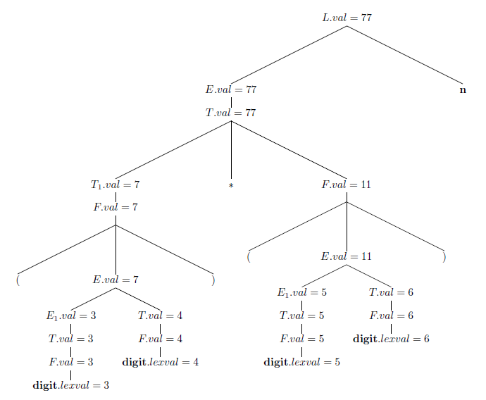
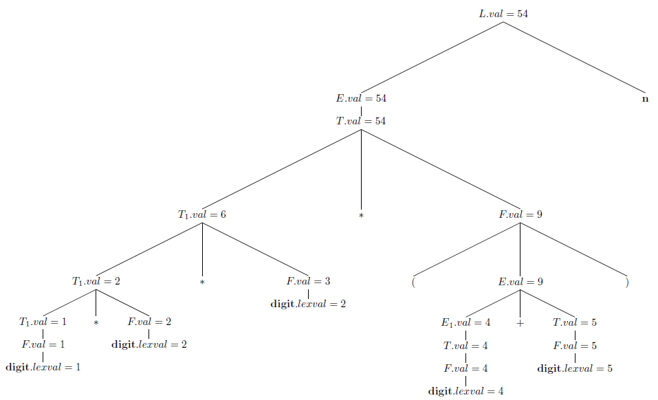
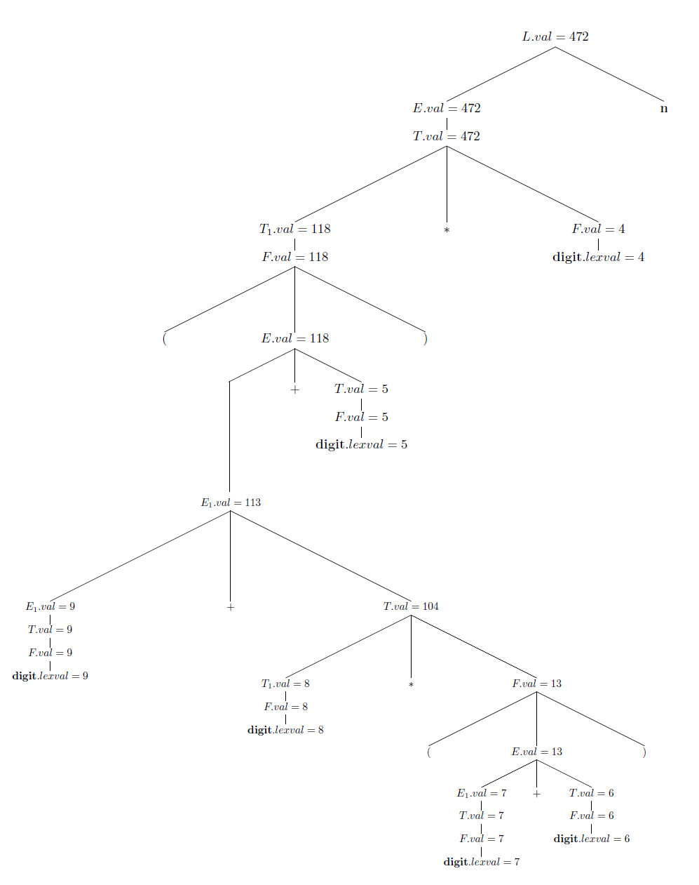

## 5.1 Syntax-Directed Definitions

### 5.1.1

> For the SDD of Fig. 5.1, give annotated parse trees for the following expressions:

> a) $$(3+4)*(5+6)~\mathbf{n}$$.

> b) $$1*2*3*(4+5)~\mathbf{n}$$.

> c) $$(9 + 8 * (7 + 6) + 5) * 4~\mathbf{n}$$.

### 5.1.2

> Extend the SDD of Fig. 5.4 to handle expressions as in Fig. 5.1.

| Production | Semantic Rules |
|:-----------|:---------------|
| $$L~\rightarrow~E~\mathbf{n}$$ | $$L.val = E.val$$ |
| $$E~\rightarrow~T~E'$$ | $$E'.inh = T.val \\ E.val = E'.syn$$ |
| $$E'~\rightarrow~+~T~E'_1$$ | $$E'_1.inh = E'.inh + T.val\\E'syn = E'_1.syn$$ |
| $$E'~\rightarrow~\epsilon$$ | $$E'.syn = E'.inh$$ |
| $$T~\rightarrow~F~T'$$ | $$T'.inh = F.val \\T.val=T'.syn$$ |
| $$T'~\rightarrow~*~F~T'_1$$ | $$T'_1.inh = T'.inh \times F.val \\ T'.syn = T'_1.syn$$ |
| $$T'~\rightarrow~\epsilon$$ | $$T'.syn = T'.inh$$ |
| $$F~\rightarrow~(~E~)$$ | $$F.val = E.val$$ |
| $$F~\rightarrow~\mathbf{digit}$$ | $$F.val = \mathbf{digit}.lexval$$ |

### 5.1.3

> Repeat Exercise 5.1.1, using your SDD from Exercise 5.1.2.

> a) $$(3+4)*(5+6)~\mathbf{n}$$.

[LaTeX](./src/5.3.1.a.tex)

> b) $$1*2*3*(4+5)~\mathbf{n}$$.

[LaTeX](./src/5.3.1.b.tex)

> c) $$(9 + 8 * (7 + 6) + 5) * 4~\mathbf{n}$$.

[LaTeX](./src/5.3.1.c.tex)
