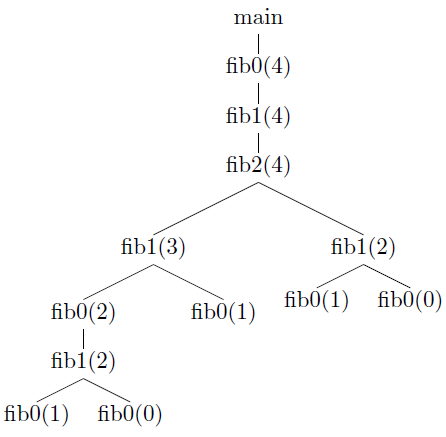

## 7.3 Access to Nonlocal Data on the Stack

### 7.3.1

> In Fig. 7.15 is a ML function `main` that computes Fibonacci numbers in a nonstandard way. Show the stack of activation records that result from a call to `main`, up until the time that the first call (to `fib0(1)`) is about to return. Show the access link in each of the activation records on the stack.



```
+-----------+
| main()    |
+-----------+
|access link|
+------------<--------------+
| fib0(4)   |   |       |   |
+---------------+       |   |
|access link|           |   |
+------------<------+   |   |
| fib1(4)   |   |   |   |   |
+---------------+   |   |   |
|access link|       |   |   |
+------------<--+   |   |   |
| fib2(4)   |   |   |   |   |
+---------------+   |   |   |
|access link|       |   |   |
+-----------+       |   |   |
| fib1(3)   |       |   |   |
+-------------------+   |   |
|access link|           |   |
+-----------+           |   |
| fib0(2)   |           |   |
+-----------------------+   |
|access link|               |
+------------<--+           |
| fib1(2)   |   |           |
+---------------+           |
|access link|               |
+-----------+               |
| fib0(1)   |               |
+---------------------------+
|access link|
+-----------+
```

### 7.3.2

> Suppose that we implement the functions of Fig. 7.15 using a display. Show the display at the moment the first call to `fib0(1)` is about to return. Also, indicate the saved display entry in each of the activation records on the stack at that time.

```
+------+                  +-----------+
| d[1] +------------------> main()    |
+------+                  +-----------+
| d[2] +---------+        |           |
+------+         |        +-----------+
| d[3] +-----+   |        | fib0(4)   |
+------+     |   |        +-----------+
| d[4] +-+   |   |        |saved d[2] |
+------+ |   |   |        +------------<--+
         |   |   |        | fib1(4)   |   |
         |   |   |        +-----------+   |
         |   |   |        |saved d[3] |   |
         |   |   |        +------------<------+
         |   |   |        | fib2(4)   |   |   |
         |   |   |        +-----------+   |   |
         +---------------->saved d[4] |   |   |
             |   |        +-----------+   |   |
             |   |        | fib1(3)   |   |   |
             |   |        +-------------------+
             |   |        |saved d[3] |   |
             |   |        +------------<------+
             |   |        | fib0(2)   |   |   |
             |   |        +---------------+   |
             |   |        |saved d[2] |       |
             |   |        +------------<--+   |
             |   |        | fib1(2)   |   |   |
             |   |        +-------------------+
             +------------>saved d[3] |   |
                 |        +-----------+   |
                 |        | fib0(1)   |   |
                 |        +---------------+
                 +-------->saved d[2] |
                          +-----------+
```
