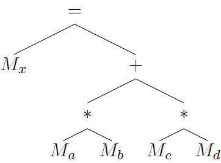
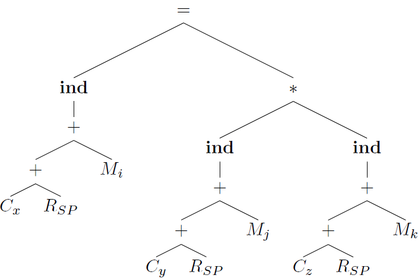
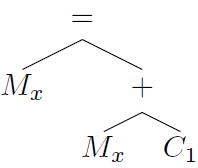

## 8.9 Instruction Selection by Tree Rewriting

### 8.9.1

> Construct syntax trees for each of the following statements assuming all nonconstant operands are in memory locations:

> a) `x = a * b + c * d`



```
LD  R0, a
LD  R1, b
MUL R0, R0, R1
LD  R2, C
LD  R3, d
MUL R2, R2, R3
ADD R0, R0, R2
ST  x, R0
```

> b) `x[i] = y[j] * z[k]`



```
LD  R0, #x
ADD R0, R0, SP
LD  R1, i
ADD R0, R0, R1
LD  R1, #y
ADD R1, R1, SP
LD  R2, z
ADD R1, R1, R2
LD  R1, *R1
LD  R2, #x
ADD R2, R2, SP
LD  R3, i
ADD R2, R2, R3
LD  R2, *R2
MUL R1, R1, R2
ST  *R0, R1
```

> c) `x = x + 1`



```
LD  R0, x
INC R0
ST  x, R0
```

### 8.9.2

> Repeat Exercise 8.9.1 above using the syntax-directed translation scheme in Fig. 8.21 in place of the tree-rewriting scheme.

> a) `x = a * b + c * d`

$$= M_x + * M_a M_b * M_c M_d$$

> b) `x[i] = y[j] * z[k]`

$$= \mathbf{ind} + + C_x R_{SP} M_i * \mathbf{ind} + + C_y R_{SP} M_j \mathbf{ind} + + C_z R_{SP} M_k$$

> c) `x = x + 1`

$$= M_x + M_x C_1$$

### 8.9.3

> Extend the tree-rewriting scheme in Fig. 8.20 to apply to while-statements.

* ifFalse Ri goto next
* generate code for subtree
* goto while

### 8.9.4

> How would you extend tree rewriting to apply to DAG's?

* Keep the tree node after reduction if it has more than one reference to it.
* Reuse the register if the register is currently contains the operand nodes.
